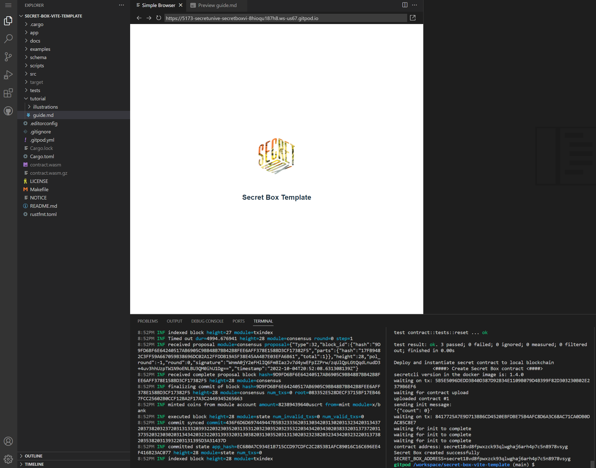
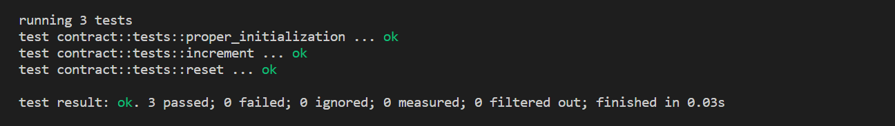

# Secret Box Template Tutorial 

This box comes with everything you need to create your own Secret Box.



## Getting Started

Aside from making your contract and app-specific changes to the template code, you'll want to update the following:

 - `Cargo.toml` - `cargo` configuration and contract dependencies
 - `README.md` - information including how to run it locally (you can use the `docs/` directory for any diagram or other images needed to document your Secret Box)
 - `integration.ts` - integration tests for your Secret Box
 - `tutorial/` - write your guide in `guide.md` and include any images in `illustrations/`
 - `app/index.html` - the name of your Secret Box in title element
 - `app/public/` - images referenced in the `index.html` go here
 - `app/src/assets/` - images for your Secret Box frontend
 - `app/src/components/SecretBox.vue` - the main frontend component

See the following steps for more details on the changes you need to make to make this your own Secret Box :tada:.

## Cargo Configuration
 - Make sure to modify the `Cargo.toml` file so it has the correct Secret Box name, author, description, etc.
    
    ``` 
    [package]
    name = "secret-box-vite-template"
    version = "0.1.0"
    authors = ["laura <laura@secretchaingirl.io>"]
    edition = "2021"
    description = "A secret box template for the simple counter contract"
    license = "MIT" 
    ```
 - And define the secret contract dependencies needed by your Secret Box
    
    ``` 
    [dependencies]
    cosmwasm-std = { git = "https://github.com/scrtlabs/cosmwasm", branch = "secret" }
    cosmwasm-storage = { git = "https://github.com/scrtlabs/cosmwasm", branch = "secret"
    schemars = "0.8.1
    serde = { version = "1.0.114", default-features = false, features = ["derive"] }
    thiserror = { version = "1.0" }
    
    # [dev-dependencies]
    cosmwasm-schema = "1.0.0"
    ```

    
## README
 - Update the `README.md` so that it's specific to your Secret Box.
 
Include instructions on setting up and running your Secret Box locally so it can be reproduced. Consider including anything you think will help [Secret University](https://scrt.university) list your secret box (upon review and approval by the core team). Based on your judgement, you might have images and even diagrams (e.g. UML), design descriptions--basically the key things you think will be helpful for Secret Network developers in learning from and using your Secret Box.


## Integration Tests
- After completing your secret contract and unit test code, modify the `integration.ts` as needed. These are super helpful for illustrating how to interact with a Secret App such as connecting to the network, querying and executing transactions, etc.

## Tutorial
This is where you'll write the guide for your Secret Box. Under the `tutorial/` directory you'll find a starting guide (this!) in `guide.md`. The Secret University platform will display the tutorial steps using the `H1, H2, H3` tags as the Table of Contents structure.
 
## Secret Box Frontend
This is where all of your frontend code goes, under the `app/` directory and is setup as a [Vite](https://vitejs.dev/guide/)  project using the [Vue](https://vuejs.org/) framework and [Typescript](https://www.typescriptlang.org/) programming language.

*Vite* is a fast, lean build tool that lets you work with a number of frameworks (e.g. *vue, react, svelte*) and either *Javascript* or *Typescript*.

If you want to use other frameworks and languages, feel free to completely revamp the frontend code, the `README.md` and `package.json` to fit your Secret Box needs.

After adding your code:

1.  Use `src/assets/logo.png` in your `src/App.vue`, which is the Secret Box logo, somewhere within the header of your application.

2. Add any box images needed as part of your guide to the `illustrations/` directory. For example, listing unit-test results in a tutorial step:


    
3. Customize the box application code as necessary.

### UI/UX
If you're able to create and implement your own Secret Box UI/UX (e.g. Figma), that's great. Secret Boxes are meant to have beautiful, intuitive and easy to use interfaces.

If you're not that kind of developer (quite common!) and don't have the UI/UX expertise to create a polished user interface,  we ask that you include a wireframe in the form of a diagram or a simple text-based description of the elements required by your box and any other notes that would be helpful for our design/implementation team to bring your box to life.

We look forward to seeing what Secret Box you will create for the Secret Network developer community :tada:.

## Notes

For reference, the Gitpod deploy/instantiation of the Secret Box contract address is noted below:

```
secret18vd8fpwxzck93qlwghaj6arh4p7c5n8978vsyg
```

